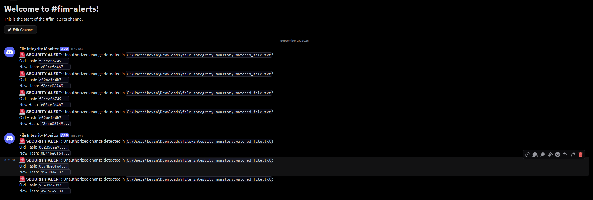

# Real-Time File Integrity Monitor (FIM) & Alerting System

A lightweight Python-based File Integrity Monitor designed to detect unauthorized file tampering, produce SIEM-ready JSON logs, and dispatch real-time alerts via Slack or Discord webhooks.

## 🛡️ Key Features
- **Cryptographic Hashing:** Computes baseline SHA-256 hashes to detect file modifications instantly.
- **SIEM-Ready Logging:** Outputs structured JSON logs (timestamps, file paths, and before/after SHA-256 hashes) ready for log aggregators like Splunk or Elastic.
- **Real-Time Webhook Alerting:** Dispatches instant security alerts via webhooks (Slack/Discord) upon integrity violations.
- **Dynamic Path Resolution:** Resolves absolute environment paths for reliable cross-platform execution.

## 📁 Project Structure
```text
file-integrity-monitor/
├── fim.py                # Main FIM monitoring agent
├── .watched_file.txt     # Target file monitored for modifications
├── requirements.txt      # Python dependencies
├── README.md             # Documentation
└── logs/
    └── file_changes.log  # Structured JSON audit log
```
## Demo

A change to the watched file triggers a Discord alert with the file path and hash values.

